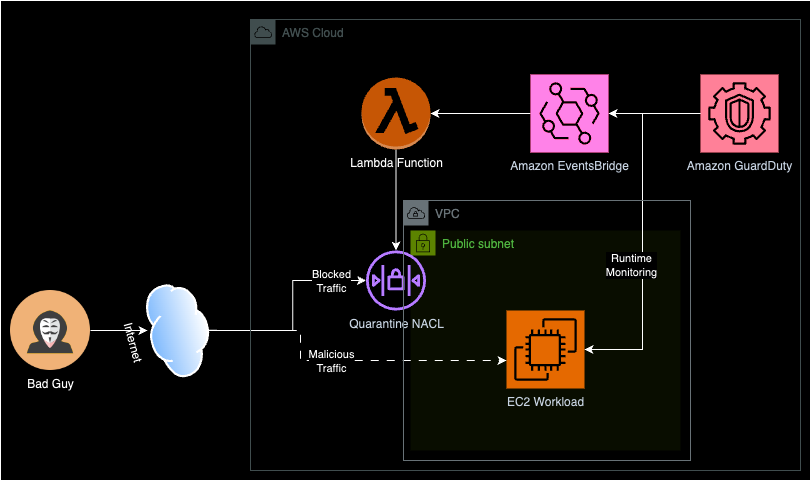

# aws-vpc-quarantine
A simple AWS VPC Quarantine solution.  
This solution automates the deployment of resources that simulates the automatic lockdown of a VPC subnet when a malicious activity is detected.  
See link [here](https://hashnode.com/draft/65fd75caa9f31955f1578f63) to the related blog post.

## Solution Architecture

### AWS Setup Prerequisite
* Enable GuardDuty (30-day free trial)
    - Enable Runtime Monitoring
        - Enable Amazon EC2 Automated agent configuration

### Deployment Walkthrough
* See Github Actions deployment pipeline [template](.github/workflows/deploy.yml)
* The deployment defaults to region `eu-west-1` (ln 19)
* Appropriate permissions are setup for the pipeline with AWS IAM and the access keys configured in the repo [secrets](https://docs.github.com/en/actions/security-guides/using-secrets-in-github-actions).
    - The configured secrets are referenced in the pipeline step `Configure AWS Credentials` (ln 14)
* Add a valid AMI ID from the EC2 console region is added to the stack parameter `Ec2ImageID` (ln 48)
* Once deployed you can check GuardDuty console after 15 minutes and VPC NACLs to confirm the `quarantine-nacl` has been deployed.

### Clean Up
In the AWS account;
1. Remove the `quarantine-nacl` association from the public-subnet.
    - Go to VPC -> Network ACLs -> `quarantine-nacl` -> Subnet associations > Edit subnet associations
2. Delete the `quarantine-nacl`
    - `quarantine-nacl` -> Actions -> Delete network ACLs
3. Disable GuardDuty (wait ~5 minutes for the Endpoints to be deleted).
    - Go to GuardDuty -> Settings -> Disable
4. Delete the CloudFormation Stack: __VPC-QUARANTINE-SOLUTION__
    - Go to CloudFormation -> select the Stack -> Delete
5. Delete the S3 bucket: `<account-id>-vpc-quarantine-solution`

### Cost
The resources deployed are free-tier eligible so if you have an eligible free-tier account it shouldn't incur any cost.  
If the account is not free-tier eligible, the resources will incur very little cost (<~$2) especially if the resources are cleaned up after simulation.

### Note
Ensure you have an existing or default VPC in the account before deployment.  
There's a weird behaviour from AWS where CloudFormation fails to create the ec2 instance with a Public IP if another VPC does not exist.